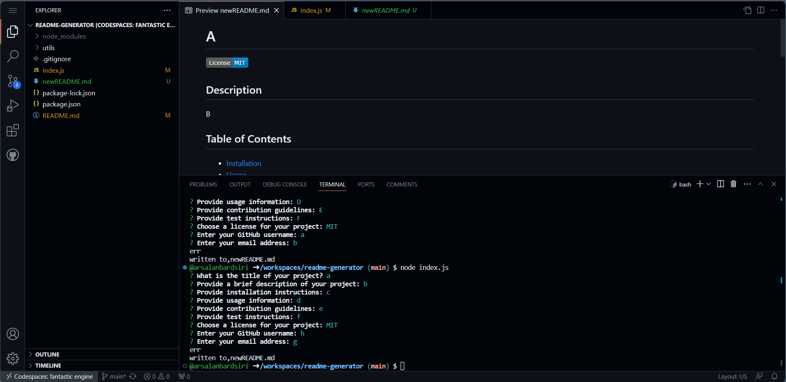

# README Generator

Welcome to the README Generator CLI tool! Simplify your project documentation process by generating professional README files using this intuitive command-line application.

## Table of Contents

- [Description](#description)
- [Features](#features)
  - [Project Title](#project-title)
  - [Description Section](#description-section)
  - [Installation Instructions](#installation-instructions)
  - [Usage Guide](#usage-guide)
  - [License Options](#license-options)
  - [Contributors Info](#contributors-info)
  - [Contact Details](#contact-details)
- [Installation](#installation)
- [Usage](#usage)
- [Technologies Used](#technologies-used)
- [Demo](#demo)
- [Contributors](#contributors)
- [Contact](#contact)
- [License](#license)

## Description

The README Generator is a Node.js command-line application that gathers input from users and outputs a structured and professional README.md file for your projects. With its easy-to-use prompts, the tool assists developers in documenting their work without the hassle of manual README formatting.

## Features

### Project Title

**One of the essential parts of any README is the project title, and this tool ensures yours stands out.** Simply input your desired title, and it's automatically set as a primary header in the generated file. This ensures that any visitor to your repository immediately understands the project's name.

### Description Section

**Every project needs a clear and comprehensive description.** This feature prompts you for a detailed explanation of your project, helping to provide visitors with an understanding of its purpose, benefits, and core functionalities. This way, potential contributors or users gain insights into what your project is about.

### Installation Instructions

**Getting started with a project should be a hassle-free process.** With the README Generator, you can provide clear, step-by-step instructions to guide users through the installation process. This ensures that even those unfamiliar with the technology stack can get your project up and running in no time.

### Usage Guide

**A project is only as good as its usability.** This feature offers the opportunity to guide users on how to use your application effectively. You can provide details, steps, and even screenshots or GIFs, ensuring that users can quickly understand how to get the most out of your project.

### License Options

**Understanding the legal aspects can be crucial for many developers.** The README Generator provides a selection of the most common open-source licenses. By selecting one, the tool automatically incorporates the appropriate license badge and details, clarifying the terms under which your project can be used or modified.

### Contributors Info

**Teamwork makes the dream work!** If your project had multiple contributors or you wish to acknowledge individuals, this feature allows you to highlight them. By adding contributor names and optionally linking their GitHub profiles, you can give credit where it's due.

### Contact Details

**Open-source is all about collaboration.** This section of the tool prompts for contact details, making it easy for other developers or users to reach out with questions, feedback, or collaboration proposals. Providing a way for the community to connect with you can lead to beneficial partnerships and project improvements.

## Installation

To use the README Generator locally:

1. Clone this repository: `git clone https://github.com/username/readme-generator.git`
2. Navigate to the project directory: `cd readme-generator`
3. Install dependencies: `npm install`
4. Run the application: `node index.js`

## Usage

- Launch the README Generator by running `node index.js` in the terminal.
- Follow the command-line prompts to input information for your project.
- Upon completion, a `newREADME.md` file will be generated in the output directory.

## Technologies Used

The README Generator utilizes the following technologies:

- 
- 

## Demo

Here's a short demo showcasing the functionality of the README Generator:

## Contributors

This project was diligently developed by [Arsalan Bardsiri](https://github.com/arsalanbardsiri).

## Contact

For inquiries, feedback, or contributions, please contact:

- Email: <arsalanbardsiri@gmail.com>
- GitHub: [github.com/arsalanbardsiri](https://github.com/arsalanbardsiri)

## License

This project is licensed under the [MIT License](LICENSE).

Thank you for considering the README Generator for your documentation needs!
